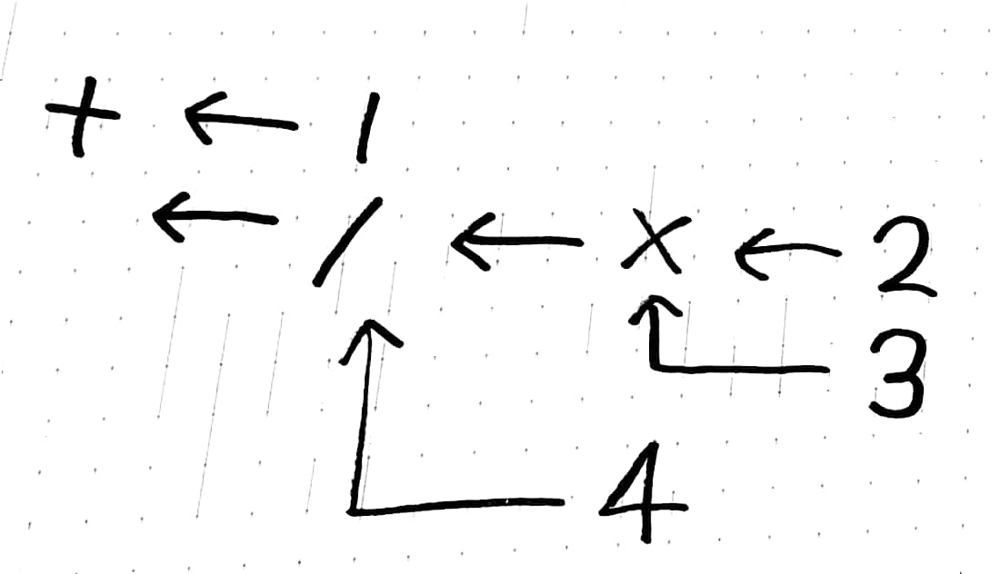

% 自作言語を自作CPUでうご
% いらいざ(@Eliza\_0x)
% 2017-10-07

## かしたいだけの人生だった

## {data-background="kosen14s.png"}

##


## 


## はじめます

## 自作言語を自作CPUでうごかしたいだけの人生だった

## 結論: 間に合いませんでした
- CPUはエミュレータのみで実機では未確認
- このエミュレータ上でコンパイラをつくった
- 自作言語は取り敢えず動いた
- 辛い人生だった

## 閑話休題

## Q. プログラミング言語ってどうやってつくるの

## A. 木にしてからﾓｸﾞﾓｸﾞﾓｸﾞﾓｸﾞﾓｸﾞﾓｸﾞ、はい

## ?????????

## ちゃんと説明します

## アセンブリ
- CPUが直接理解できる命令
- `add $1 $2 $3`
- `jmp LABEL`
- 授業でCASLをやったことのあるひともいらっしゃるんじゃないでしょうか？

## アセンブリ
- わたしたちが書いたプログラムからアセンブリを生成するのが目標
- 『適切に中間表現を定めてやればわりといける』
- 私の作った言語では
- パース→アルファ変換→型推論→K正規化(嘘)→A正規化(嘘)→レジスタ割り当て→（ここで適当な変換をかましている）→アセンブリ生成
をしているのでひとつずつ解説していきます

## パース
- プログラムのままでは処理するのが大変…
- 木構造に変換する
- 木構造？

## パース
- `main = 1 + 2 * 3 / 4;`
- みたいなプログラムがありますね。これは優先順位があるので
- `main = 1 + ((2 * 3) / 4)`
- みたいにしても問題ないですよね？ここから各演算子を関数みたいに前にもってきます
- `main = (+ 1 (/ (* 2 3) 4)`
- みたいにへんかんします

## パース
- `main = (+ 1 (/ (* 2 3) 4)`
- これはこんなグラフ構造としても理解できますね


## アルファ変換

```
main n = let
   n = 5;
   in n;
```

このプログラムでのnは場所によって意味が変わってくる→だからいいかんじに変換して一意な名前をつけてしょりしやすくしたい

## アルファ変換

```
main n1 = let
    n2 = 5
    in n2;
```

こんなかんじ

## 型推論

こんなことしませんか

```
"hoge" + 5
```

これ、ヤバイですよね

## 型推論

こんなかんじのバグをコンパイル時に排除したい

1 * 2 + true

+ の両辺には数値型しか来てはいけないのでこれはおかしい！等の規則を用いて演繹します。

## K正規化

アセンブリでは一度に一つの命令しか処理できない

1 + 2 * 3

## K正規化(疑)

```
b = 2 * 3
a = 1 + b
```

内部的にはbやaではなくて、uuidといって絶対に衝突しない乱数のようなものを振っている

## A正規化(疑)

K正規化をすると数式等は展開できる、けどif式やlet文は展開できない→アセンブリを生成する時は邪魔

## A正規化(疑)

```
main = if true
	    then 1 * 2 + 3
	    else 2 * 3 + 4;	
```

## なんかいろいろな処理

アセンブリに変換しやすいようにif文を分解したり匿名関数に名前をあたえたりする

```
main = if true 
	    then 1 * 2 + 3

else = 2 * 3 + 4
```

## レジスタ割付

プログラム上では変数は無限に宣言できる

CPU内で使えるデータには限りがある

生きている変数をいいかんじにかんりして変数と対応させる

## アセンブリ生成

できるだけアセンブリに近づけた内部構造からアセンブリを生成する

## アセンブリ生成

ここまでいい感じに内部構造を変換しているので割と簡単にアセンブリは生成できる

アセンブリ？？？？？？
----

アセンブリわからん
----

CPUつくるか
----

## どうやってCPUつくるん？

- パタヘネを読んでCPUがどんなかんじで動くか理解する
- システム記述言語といって論理回路を生成できるプログラミング言語みたいなやつをつかう
- やるだけ

## やりかた(雑に
- 1クロックに一つ命令を読む
- マルチプレクサとかで解読
- 計算
- はじめにもどる

## OSSです: tmpla
[eliza0x/tmpla](https://github.com/eliza0x/tmpla)

## ためしにうごかしてみます

## {data-background="kosen14s.png"}

## まとめ
- わりとCPUはつくれる
- わりとコンパイラもつくれる

